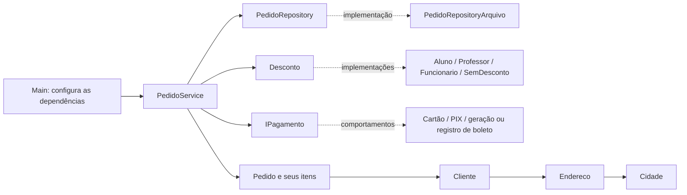

# Relatório da Sprint 4 — Refatoração e princípios de projeto

Disciplina: Gestão do Ciclo de Vida da Aplicação. Data de conclusão local: 12/09/2026.

## Objetivo e fontes

Refatorar a loja acadêmica em Java aplicando os sete princípios indicados no estudo dirigido, com preservação do comportamento essencial, justificativa das decisões e verificação após cada etapa.

Materiais utilizados, disponíveis na pasta superior:

- `Roteiro completo refatoração.pdf`, páginas 1–4: sequência das sete etapas e reflexões finais.
- `Roteiro Refatoração (Simplificado).pdf`, páginas 1–3: princípios e orientações de preservação de comportamento.
- `ProjetoPrincipiosDesignJava.zip`, especialmente o `README_ALUNO.md` e os 13 fontes originais.
- `Fluxograma Atual (1).png` e `Fluxograma Refatorado.png`: referências visuais de organização.

O ZIP original foi preservado, com SHA-256 `AF66B865D9DE7383BBB7D4E7DBD84B6E29378695017D8EFF8A0AB3794BDD3A73`. A atividade foi realizada e verificada localmente, sem envio ao GitHub.

## Etapa 1 — Responsabilidade Única (SRP)

**Problema original:** `PedidoService.finalizarPedido` calculava o pedido, montava uma linha de texto, abria/escrevia arquivo, tratava falha de I/O, apresentava o resumo, escolhia pagamento e imprimia uma confirmação. Alterar o armazenamento exigia modificar a classe responsável pelo fluxo do pedido.

**Solução:** foram criados `PedidoRepository`, contrato de salvamento, e `PedidoRepositoryArquivo`, responsável pela escrita e pelo tratamento de `IOException`. O serviço recebe o repositório e chama `repository.salvar(pedido, total)`.

**Justificativa:** a persistência passou a ter um ponto próprio de manutenção, podendo mudar independentemente do fluxo de finalização. A pequena interface também permite verificar o serviço com repositórios substitutos em testes, sem gravar arquivos para todos os cenários.

**Preservado:** arquivo `pedidos.txt`, criação quando inexistente, acréscimo de linhas, formato `nome;total`, quebra de linha da plataforma, mensagem de erro e causa da falha de escrita. As mensagens de progresso continuam no serviço.

**Arquivos principais:** `PedidoRepository.java`, `PedidoRepositoryArquivo.java`, `PedidoService.java` e configuração no `Main.java`.

## Etapa 2 — Segregação de Interfaces (ISP)

**Problema original:** `IPagamento` exigia `pagar`, `parcelar` e `gerarBoleto` de todas as formas de pagamento. Isso criava métodos sem utilidade, mensagens de “operação não utilizada” e uma exceção de parcelamento em PIX.

**Solução:** a interface foi dividida em três contratos:

| Contrato | Operação | Implementações pertinentes |
| --- | --- | --- |
| `IPagamento` | `pagar(double)` | Cartão, PIX e registro de boleto |
| `Parcelavel` | `parcelar(double, int)` | Cartão |
| `GeraBoleto` | `gerarBoleto(double)` | Boleto |

**Justificativa:** as classes dependem apenas das capacidades que oferecem. Foram removidas as operações artificiais sem funcionalidade; pagamento, parcelamento de cartão, registro de boleto e geração de linha digitável permanecem disponíveis.

**Arquivos principais:** `IPagamento.java`, `Parcelavel.java`, `GeraBoleto.java` e as três classes de pagamento.

## Etapa 3 — Composição sobre herança

**Problema original:** `PedidoService extends PagamentoCartao` afirmava que um serviço de pedidos era uma forma de pagamento por cartão. O serviço herdava operações que não pertenciam à sua responsabilidade.

**Solução:** a herança foi removida. Nesta etapa, o pagamento por cartão passou a ser utilizado por composição, por meio de um objeto com tipo `IPagamento`. Na etapa 6, esse objeto passou a ser fornecido externamente pelo construtor.

**Justificativa:** a relação correta é “o serviço utiliza um pagamento”. O serviço pode coordenar qualquer implementação que cumpra o contrato de pagamento, sem se tornar uma delas.

**Arquivo principal:** `PedidoService.java`.

## Etapa 4 — Lei de Demeter / Menor Conhecimento

**Problema original:** para obter a cidade, o serviço conhecia a sequência `pedido.getCliente().getEndereco().getCidade().getNome()`. Mudanças na estrutura interna do endereço poderiam exigir alterações no serviço.

**Solução:** a navegação foi distribuída pelas classes que conhecem seus próprios componentes:

```text
PedidoService.obterCidadeEntrega(pedido)
  -> Pedido.getCidadeEntrega()
  -> Cliente.getCidadeEntrega()
  -> Endereco.getNomeCidade()
  -> Cidade.getNome()
```

Também foi criado `Pedido.getNomeCliente()`, utilizado no resumo, na confirmação e na persistência.

**Justificativa:** o serviço pede uma informação ao pedido, e cada objeto delega apenas ao seu componente imediato. Os getters originais foram mantidos, e o resultado acompanha alterações posteriores no domínio, sem cópias de dados ou cache de cidade.

**Arquivos principais:** `Endereco.java`, `Cliente.java`, `Pedido.java`, `PedidoService.java` e `PedidoRepositoryArquivo.java`.

## Etapa 5 — Aberto/Fechado (OCP)

**Problema original:** `calcularTotal` decidia o desconto por uma cadeia de `if/else` com as strings `ALUNO`, `PROFESSOR` e `FUNCIONARIO`. Cada novo desconto exigia alterar o serviço.

**Solução:** foi criada a interface `Desconto`, cujo método `aplicar(subtotal)` retorna o total com a regra aplicada. Foram implementadas `DescontoAluno` (10%), `DescontoProfessor` (15%), `DescontoFuncionario` (20%) e `SemDesconto`.

O serviço calcula o subtotal dos itens e delega a aplicação da regra ao desconto recebido no construtor.

**Justificativa:** novas regras podem ser adicionadas por novas implementações. O serviço não precisa identificar categorias de clientes nem conhecer percentuais.

**Preservado:** subtotal, multiplicação por preço e quantidade, percentuais e possibilidade de não aplicar desconto. Para o exemplo de R$ 160,00, os resultados são R$ 144,00, R$ 136,00, R$ 128,00 e R$ 160,00.

**Mudança decorrente da refatoração:** a mesma regra recebida pelo serviço é usada no cálculo e na finalização. O literal `"ALUNO"` antes fixado dentro de `finalizarPedido` foi removido. O `Main` continua escolhendo `DescontoAluno`, mantendo o comportamento da demonstração original.

**Arquivos principais:** `Desconto.java`, suas quatro implementações, `PedidoService.java` e `Main.java`.

## Etapa 6 — Inversão de Dependência (DIP)

**Problema original:** `finalizarPedido` recebia uma string, decidia a classe e criava diretamente cartão, PIX ou boleto. A classe de alto nível dependia das implementações concretas.

**Solução:** `PedidoService` recebe `PedidoRepository`, `Desconto` e `IPagamento` no construtor. O `Main` monta as implementações. Na finalização, o serviço executa somente `pagamento.pagar(total)`.

**Justificativa:** a escolha e a construção das dependências ficam na entrada da aplicação. O fluxo do pedido funciona com os contratos, permitindo extensão e teste isolado.

**Preservação do boleto:** no original, a opção `BOLETO` chamava `gerarBoleto`, e não `pagar`. Por isso, quem deseja esse fluxo fornece `boleto::gerarBoleto` como implementação funcional de `IPagamento`. Essa adaptação mantém a geração da linha digitável sem criar uma condicional ou dependência de boleto no serviço. A operação de registro `PagamentoBoleto.pagar` continua disponível separadamente.

**Entradas inválidas:** a API não recebe mais strings de pagamento. O caso anterior de texto desconhecido, que podia finalizar sem pagar, deixa de existir nessa interface tipada. Referências nulas são recusadas no construtor antes de qualquer gravação. Não foi acrescentado menu ou mecanismo de leitura de strings, porque isso não faz parte do exercício.

**Arquivos principais:** `PedidoService.java` e `Main.java`; exemplos de configuração no README e nos testes.

## Etapa 7 — Substituição de Liskov (LSP)

**Problema original:** `Entrega.calcularFrete` retornava R$ 15,00, mas `EntregaRetiradaLoja`, sua subclasse, lançava exceção para total abaixo de R$ 50,00. A substituição introduzia uma restrição que não estava representada pelo contrato da classe-base.

**Solução:** as duas classes passaram a implementar `TipoEntrega`, sem herança entre elas. O contrato explicita que, para um total finito e não negativo, `calcularFrete` retorna:

- `OptionalDouble` com valor: modalidade disponível e preço do frete.
- `OptionalDouble.empty()`: modalidade indisponível para aquele total, sem exceção por indisponibilidade.

**Justificativa:** o consumidor pode utilizar qualquer modalidade com a mesma chamada e tratar disponibilidade pelo resultado, sem conhecer a classe concreta. A solução altera o contrato para representar uma possibilidade real do domínio, e não apenas troca uma classe por uma interface mantendo a surpresa.

**Preservado:** domicílio custa R$ 15,00; retirada custa zero a partir de R$ 50,00; retirada abaixo desse limite continua proibida. A mudança explícita é a forma de sinalizar indisponibilidade: resultado vazio no lugar da exceção.

O `Main` não utilizava entrega no fluxo original. Não foi acrescentado frete ao cálculo da demonstração, que permanece R$ 144,00. Os cenários de entrega foram verificados nos testes.

**Arquivos principais:** `TipoEntrega.java`, `Entrega.java` e `EntregaRetiradaLoja.java`.

## Comparação das estruturas

| Aspecto | Antes | Depois |
| --- | --- | --- |
| Salvamento | Escrita e tratamento de I/O no serviço | Repositório de arquivo separado |
| Pagamento | Interface ampla e condicionais no serviço | Interfaces específicas e objeto fornecido externamente |
| Relação serviço/cartão | Herança inadequada | Composição |
| Cidade | Serviço navega por cinco objetos/informações | Delegação pelas classes de domínio |
| Desconto | Strings e percentuais no serviço | Estratégias de desconto independentes |
| Finalização | Recalcula sempre como aluno | Utiliza a regra configurada |
| Entrega | Subclasse introduz exceção inesperada | Contrato comum com disponibilidade explícita |
| Verificação | Apenas demonstração manual fornecida | Execução por etapa e 23 testes automatizados |



As entregas são verificadas separadamente pelo contrato `TipoEntrega`; não foram conectadas ao fluxo original de finalização. O banco de dados e os campos adicionais mostrados no PNG de referência não foram implementados, pois não são exigidos pelos roteiros. O diagrama fornecido também tem setas de pagamento e cardinalidade cliente/pedido inconsistentes; a implementação segue o código e os contratos descritos neste relatório.

## Reflexões finais

**Quais classes ficaram com responsabilidades mais claras?**

`PedidoRepositoryArquivo` concentra a persistência; as implementações de `Desconto` concentram cada regra; as classes de pagamento oferecem somente suas operações pertinentes; `Pedido`, `Cliente` e `Endereco` encapsulam o acesso aos dados que conhecem; as entregas seguem um contrato explícito. `PedidoService` mantém a coordenação da finalização, o cálculo do subtotal e a apresentação simples de console, delegando os comportamentos variáveis.

**Para adicionar uma nova forma de pagamento, quantas classes existentes precisam mudar?**

Cria-se uma implementação de `IPagamento` e seleciona-se essa implementação no ponto de configuração, atualmente o `Main`. Zero classes existentes de regra de negócio precisam mudar; o ponto de composição precisa ser ajustado para usar a novidade. As implementações antigas e o serviço permanecem intactos.

**E para um novo tipo de desconto?**

O raciocínio é o mesmo: uma nova implementação de `Desconto` e sua seleção no ponto de composição. Zero alterações nas regras já existentes e no serviço. O teste de extensão utiliza um desconto de convênio de 5% e uma forma de pagamento substituta para comprovar essa possibilidade sem alterar o código de produção.

## Verificação executada

Foi utilizado Microsoft Build of OpenJDK 17.0.20.1+1, no Windows, com compilação `--release 17 -encoding UTF-8 -Xlint:all -Werror`. O JDK portátil foi baixado da [fonte oficial da Microsoft](https://learn.microsoft.com/en-us/java/openjdk/download); SHA-256 do pacote conferido: `3D9006956FC8AF5601CD24FFC4F468BEF48279C7EBD8171B9BDF90D0AABFBF1F`.

| Registro | Resultado |
| --- | --- |
| Etapa 0: original | Compilação e execução aprovadas; referência registrada |
| Etapa 1: SRP | Aprovada; saída e arquivo de pedidos iguais ao original |
| Etapa 2: ISP | Aprovada; saída e arquivo de pedidos iguais ao original |
| Etapa 3: composição | Aprovada; saída e arquivo de pedidos iguais ao original |
| Etapa 4: Demeter | Aprovada; saída e arquivo de pedidos iguais ao original |
| Etapa 5: OCP | Aprovada; saída e arquivo de pedidos iguais ao original |
| Etapa 6: DIP | Aprovada; saída e arquivo de pedidos iguais ao original |
| Etapa 7: LSP | Aprovada; saída e arquivo de pedidos iguais ao original |
| Testes finais | 23 aprovados; zero falhas |

As evidências `evidencias/etapa-00-*` a `etapa-07-*` foram geradas durante a execução de cada etapa. Os JSONs registram data, versão Java, verificação e SHA-256 dos fontes de produção daquele momento. Os arquivos `*-saida.txt` e `*-pedidos.txt` permitem comparar os resultados. Eles não são cópias completas das versões intermediárias do código.

Os testes finais verificam descontos, pedido vazio, acesso ao domínio, cartão, PIX, geração e registro de boleto, parcelamento, criação e acréscimo em arquivo UTF-8, falha real de escrita, ordem da finalização, propagação de falhas, extensão por novas implementações e disponibilidade de entrega nos limites do valor mínimo. A lista completa e seu resultado estão em `evidencias/testes.txt`.

## Limites mantidos e conclusão da atividade

A aplicação continua didática: utiliza `double` como o projeto original, simula pagamentos e mensagens no console, armazena nome e total em arquivo e salva antes de processar o pagamento. Não há transação com reversão de arquivo se o pagamento falhar, banco de dados ou aplicação web. Essas funcionalidades não foram acrescentadas como parte da refatoração solicitada.

As sete etapas foram implementadas, justificadas e verificadas. Os materiais originais foram preservados e a entrega ficou preparada localmente, sem publicação ou envio para o GitHub.
